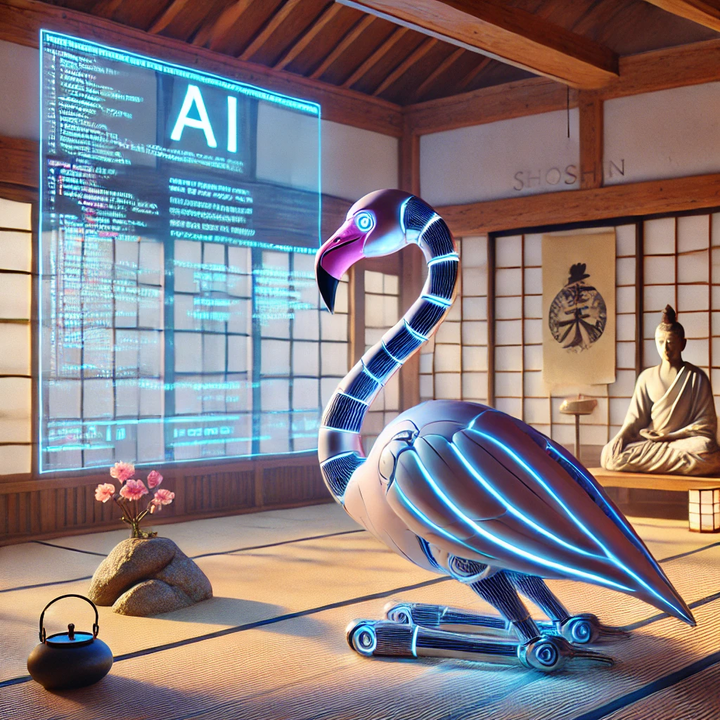

## Shoshin Flamingo team:

* [Shoshin (初心)](https://en.wikipedia.org/wiki/Shoshin): The Zen term for `Beginner's mind` that includes openness,
  eagerness, and lack of preconceptions.
* **Flamingo 🦩**: the mascot of the company we work on: [LastMinute.com](https://www.es.lastminute.com/). While we are **not** an official team, we appreciate our [free Friday time for learning](https://technology.lastminute.com/tech-learning-and-development-friyay/) and the [O'Reilly](https://www.oreilly.com/) license used to participate in the event.

And we are:
* [Pedro Grau](https://github.com/pedrograuminute)
* [Borja Bravo](https://github.com/borjab)
* Our third member, unfortunately, got sick and couldn't participate in the Kata.  
