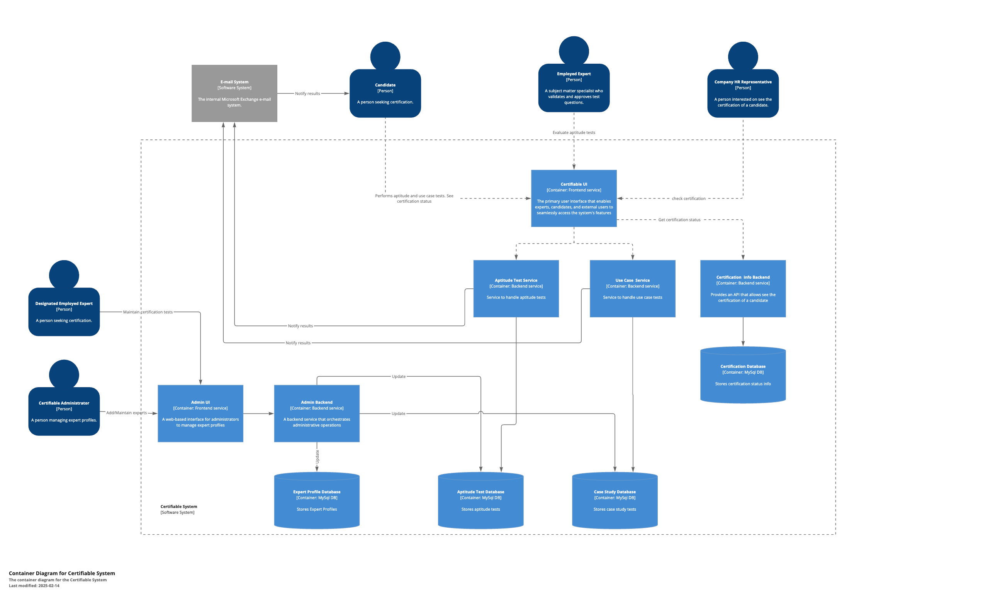

# C2 Container

## Description
This Container diagram provides a deeper look into how the **Certifiable System** is structured internally. It shows the main software services (containers), the databases they rely on, and how each actor interacts with these components.

## Containers and Their Responsibilities

1. **Certifiable UI (Frontend Service)**
    - A web-based interface for candidates, employed experts, designated employed experts, and company HR representatives.
    - Facilitates test-taking, viewing results, and certification checks.

2. **Aptitude Test Service (Backend Service)**
    - Manages creation, retrieval, and submission of aptitude tests (multiple-choice and short-answer).
    - Communicates with the **Aptitude Test Database** to store and retrieve questions and responses.

3. **Use Case Service (Backend Service)**
    - Handles the second part of the certification process: architecture use case submissions.
    - Interacts with the **Case Study Database** to store and retrieve case studies and candidate submissions.

4. **Certification Info Backend (Backend Service)**
    - Exposes an API for checking and updating a candidate’s certification status.
    - Reads from and writes to the **Certification Database**.

5. **Admin UI (Frontend Service)**
    - A specialized interface for the **Certifiable Administrator** to manage expert profiles and system settings.

6. **Admin Backend (Backend Service)**
    - Orchestrates administrative tasks, including adding and maintaining expert information.
    - Interacts with the **Expert Profile Database** to store and manage expert data.

## Databases

1. **Aptitude Test Database**
    - Stores and retrieves aptitude test questions and candidate responses.

2. **Case Study Database**
    - Maintains all case study materials and candidate architecture submissions.

3. **Certification Database**
    - Keeps track of certification statuses, including pass/fail results and candidate information.

4. **Expert Profile Database**
    - Contains expert profiles and related data, enabling expert management and assignments.

## Actors

1. **Candidate (Person)**
    - Takes aptitude and use case tests, views results, and checks certification status via the **Certifiable UI**.

2. **Employed Expert (Person)**
    - Evaluates and grades aptitude tests and use case submissions, providing feedback through the **Certifiable 
