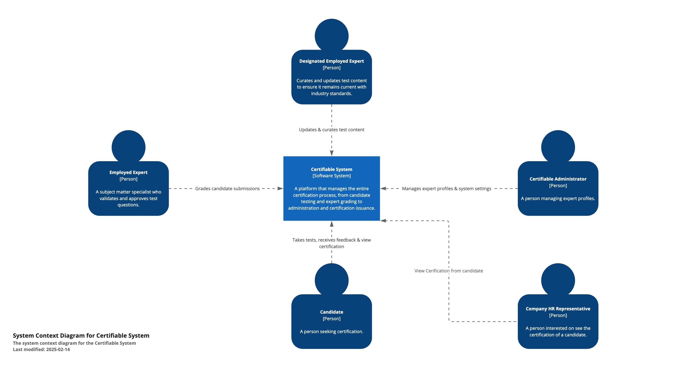

# C1 Context

This diagram provides a high-level overview of the **Certifiable System** and the external actors that interact with it. It illustrates how each actor (people or roles) connects to the core system, reflecting their primary responsibilities and touchpoints.

## Components and Actors

1. **Certifiable System (System)**
   - A platform that manages the entire certification process, from candidate testing and expert grading to administration and certification issuance.

2. **Candidate (Person)**
   - A person seeking certification. They take the aptitude test (multiple choice and short answer) and submit an architecture solution, receiving feedback and a final score.

3. **Employed Expert (Person)**
   - A subject matter specialist responsible for grading candidate submissions, providing feedback, and ensuring the integrity of the certification process.

4. **Designated Employed Expert (Person)**
   - An expert who curates and updates test content, such as adding new questions and modifying existing ones to keep the certification program current with industry standards.

5. **Certifiable Administrator (Person)**
   - Oversees administrative operations, including managing expert profiles, system configurations, and ensuring overall system security and efficiency.

6. **Company Rep/Verifier (Person)**
   - An external stakeholder or organization representative who may verify a candidate’s certification status and score through the system.

## Diagram Explanation
- The **Certifiable System** stands at the center, orchestrating the entire certification workflow.
- **Candidates** interact with the system to take tests, submit architecture solutions, and receive results.
- **Employed Experts** and **Designated Employed Experts** both use the system, but with different focuses: one grades and provides feedback, while the other maintains and updates the test materials.
- The **Certifiable Administrator** ensures that the experts are properly set up in the system and that everything runs securely and efficiently.
- **Company Reps** can query the system to verify certification details, ensuring they have the most up-to-date information on a candidate’s credentials.
