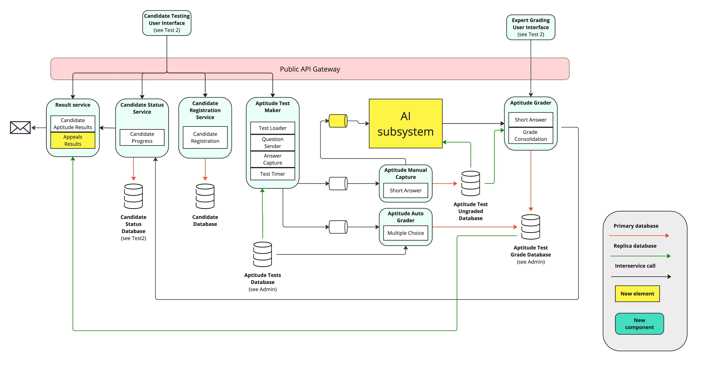
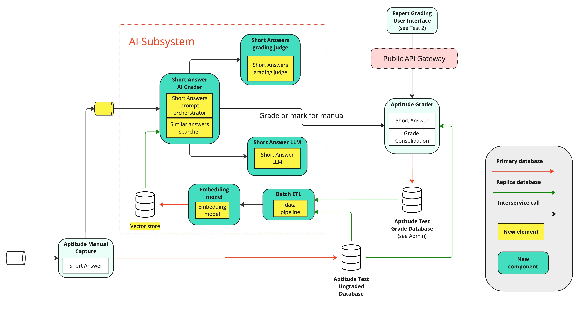
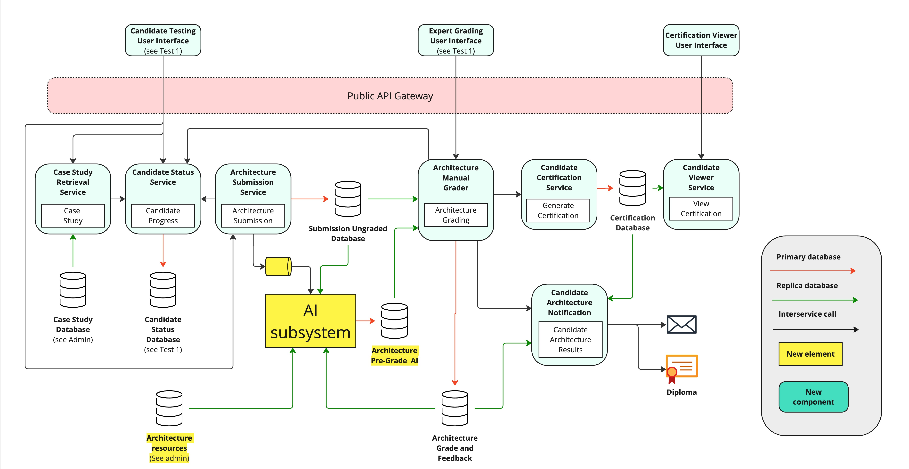
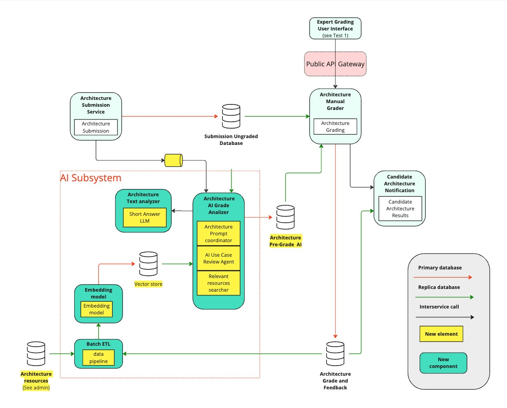

# 🦩 `Shoshin Flamingo`'s architecture Kata (Winter 2025): SoftArchCert, Certifiable, Inc

* [About the team](1-about-the-team/README.md)
* [Problem definition](2-problem-space/README.md)
* [Solution space](3-solution-space/README.md)
* [Decisions (ADR)](4-decisions%20(ADRs)/README.md)
* [Diagrams](5-diagrams/README.md)

# Introduction

Certifiable, Inc. is a market leader in software architecture certification, celebrated for its flagship system, SoftArchCert, which has enabled countless professionals to advance their careers. As the demand for certified software architects surges globally—driven by expanding markets in Europe, the U.K., Asia, and beyond—our current manual processes are increasingly challenged by the need to handle a much higher volume of certification requests.

To meet these challenges and support exponential growth, we are undertaking a strategic initiative to integrate Generative AI across our certification architecture. This transformation is designed not only to scale our operations but also to enhance the quality, accuracy, and fairness of our certification process.

Our new architecture leverages AI in multiple, complementary ways:

- **AI Aptitude Test Generator Service:**  
  This service automates the creation of aptitude tests by incorporating two key components:
    - **State-of-art Analyzer:** Continuously monitors industry trends and best practices to ensure that test questions remain modern and relevant.
    - **Question Shuffler:** Dynamically reconfigures and rephrases existing questions to prevent memorization, ensuring each test is unique and effectively evaluates a candidate’s true aptitude.

- **AI as a Judge:**  
  An AI-based component that double-checks the grading of short-answer questions to enhance accuracy and data integrity. This layer not only streamlines the grading process but also provides valuable metrics for continuous improvement.

- **Candidate Appeals:**  
  A robust appeal mechanism that allows candidates to flag potential issues in grading. This process combines expert review with AI insights, ensuring transparency and fairness while providing critical feedback for ongoing refinement of our grading systems.

By integrating these AI-driven components, our new architecture aims to:
- **Scale Efficiently:** Handle a significant increase in certification requests without compromising performance.
- **Enhance Test Quality:** Continuously update and improve test content to reflect current industry standards.
- **Improve Grading Accuracy:** Leverage AI to verify grading decisions, reducing manual workload and human error.
- **Foster Transparency:** Empower candidates with an effective appeals process that reinforces trust in our certification system.

This initiative marks a forward-thinking evolution of Certifiable, Inc.'s technology, ensuring that we not only keep pace with industry advancements but also set new standards for efficiency, quality, and fairness in certification.

## Main changes

### Aptitude Test

### Architecture practical case

### Admin interfaces

