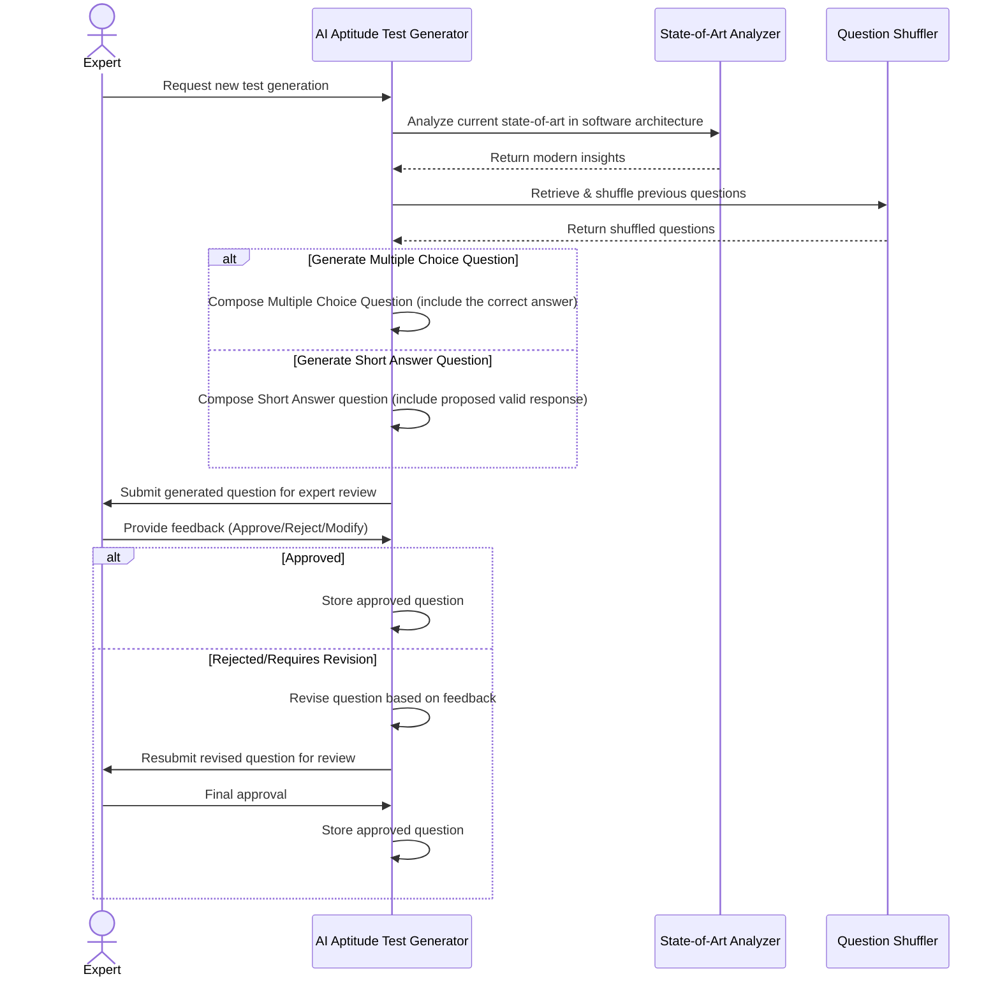

```mermaid
sequenceDiagram
    actor E as Expert
participant QG as AI Aptitude Test Generator
participant SOA as State-of-Art Analyzer
participant QS as Question Shuffler


    E->>QG: Request new test generation
    QG->>SOA: Analyze current state-of-art in software architecture
    SOA-->>QG: Return modern insights
    QG->>QS: Retrieve & shuffle previous questions
    QS-->>QG: Return shuffled questions

    alt Generate Multiple Choice Question
        QG->>QG: Compose Multiple Choice Question (include the correct answer)
    else Generate Short Answer Question
        QG->>QG: Compose Short Answer question (include proposed valid response)
    end

    QG->>E: Submit generated question for expert review
    E->>QG: Provide feedback (Approve/Reject/Modify)
    alt Approved
        QG->>QG: Store approved question
    else Rejected/Requires Revision
        QG->>QG: Revise question based on feedback
        QG->>E: Resubmit revised question for review
        E->>QG: Final approval
        QG->>QG: Store approved question
    end
```