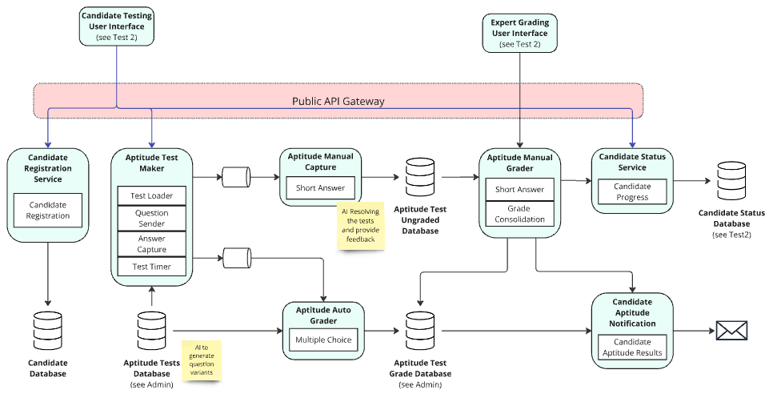
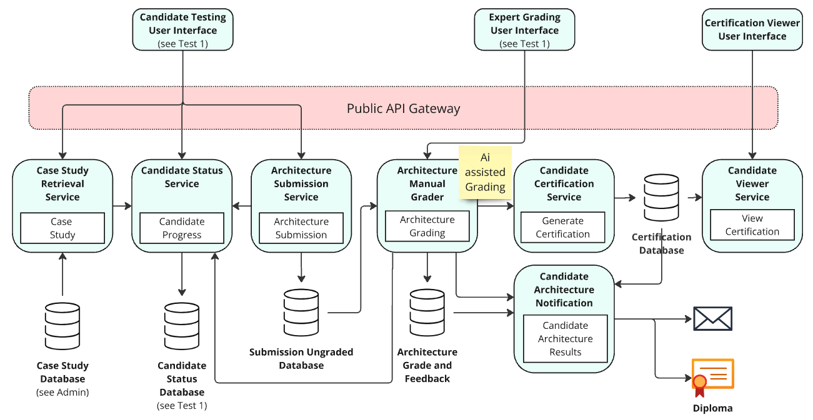
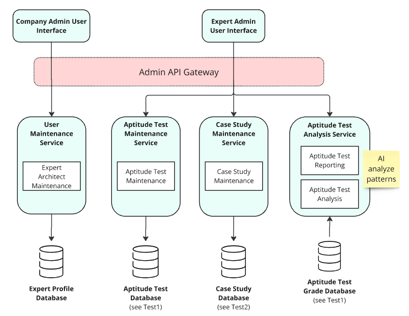

# Opportunities to use AI

## In aptitude test
* To grade short questions
* To generate variants of the tests

 

## For the architecture use case

We considered both assisted and automated grading, but automated grading was considered too risky.  

## Automatically detecting issues in questions

Detecting patterns is a perfect use case for AI.

