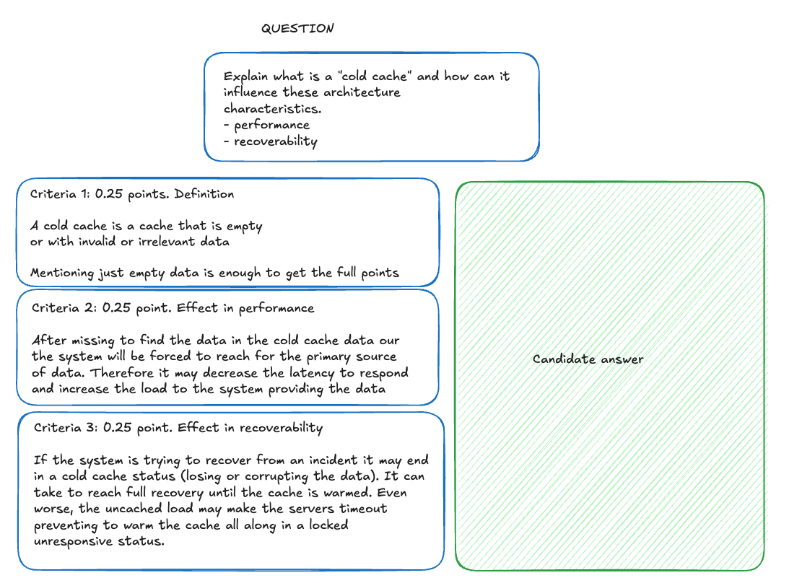

# Solving short answers with AI

Driven by the need of precise grading, we need something better than just asking a LLM model to grade
the short answers.
Those models have a small chance of hallucinations and are not trained for software architecture.

Training our very owm LLM for software architecture short answers would be extremely costly
and will require a lot of architecture data to feed it. 

Thankfully, our expert architects can create both questions and answer criteria for the short answers.

We can also ask our LLM to:
 * Rate in a scale of 1 to 10 how well does the candidate answer match each of the evaluation criteria.
 * How sure is it about their answer? We can decide when the AI grading is too risky or a very original question
that may require human grading. 

 * What part of the answer was irrelevant

We can also enrich the data with Rag or even Reag by providing examples of old corrections that are good, bad or
 similar to this specific answer.